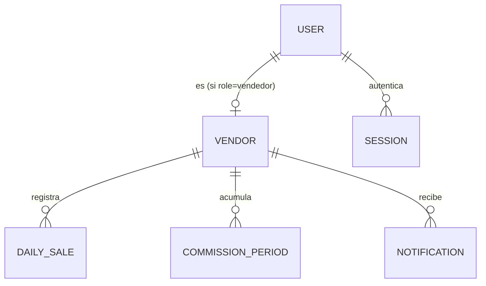

# Functional Design — api-contract — Functional Spec

## Sources

- [upstream:entities] `construction/api-contract/functional-design/entities.md`
- [upstream:rules] `construction/api-contract/functional-design/rules.md`
- [upstream:contract-summary] `inception/contract-design/contract-summary.md`
- [upstream:unit-of-work] `inception/units-generation/unit-of-work.md` — consultado para confirmar el alcance de `api-contract` como unidad `spec` ("incluye solo forma de datos y firmas de endpoints — nunca lógica de negocio"), el límite que estructura todo este documento.
- [upstream:unit-of-work-story-map] `inception/units-generation/unit-of-work-story-map.md` — consultado y descartado como fuente de trazabilidad de esta unidad (Q3 de `functional-design-questions.md`): `api-contract` no tiene historias de usuario propias asignadas en ese mapa (es un contenedor de contrato, no un actor de negocio), así que `traceability.json` traza contra los criterios de aceptación puramente de forma de contrato en su lugar, no contra `unit-of-work-story-map.md`.

Esta unidad no ejecuta workflows de negocio (eso vive en `backend-api`); lo que sí tiene forma propia es el **flujo del contrato en sí** — la secuencia de llamadas que un cliente hace contra la API y las transiciones de estado que el contrato expone (sesión, venta, período). Eso es lo que este documento especifica.

## Workflow 1 — Autenticación de vendedor

1. Cliente envía `POST /api/v1/auth/login/vendedor` con `username`/`password`.
2. Si las credenciales son válidas (BR1.1 aplica a los endpoints subsiguientes, no a este) → se crea una `Session` sin `expiresAt` (sesión de larga duración, FR1.4) → responde `200` con `token`.
3. Si son inválidas → responde `401`.
4. Cliente usa `token` como `Authorization: Bearer` en cada llamada subsiguiente.
5. Cliente envía `POST /api/v1/auth/logout` → la `Session` asociada al token pasa a `revokedAt` no nulo → responde `204`.

## Workflow 2 — Autenticación de supervisor

Igual al Workflow 1, pero vía `POST /api/v1/auth/login/supervisor` con `pin`, y el rol resuelto del token es `supervisor` — habilita los endpoints marcados con BR1.2/BR1.3.

## Workflow 3 — Registrar venta del día (con conexión)

1. Cliente (autenticado como vendedor) envía `POST /api/v1/sales` con `saleDate`, `amount`, `returns`.
2. BR3.1 valida el monto/devoluciones → si falla, `400`.
3. BR3.2 valida que el día no esté cerrado → si falla, `409`.
4. Si pasa ambas → se crea o actualiza (BR3.3, idempotente) el `DailySale` de `(vendorId, saleDate)` → responde `200` con el registro.

## Workflow 4 — Sincronizar ventas guardadas sin conexión

1. Cliente envía `POST /api/v1/sales/sync` con un lote de ventas, cada una con su propia `saleDate`.
2. Por cada ítem del lote, se aplica el mismo flujo del Workflow 3 de forma independiente (BR3.1, BR3.2, BR3.3) — un ítem rechazado no afecta a los demás del lote.
3. Responde `200` con el resultado por ítem (`applied` o `rejected` con motivo).
4. Un reintento del mismo lote (ej. tras un fallo de red a mitad del envío original, AC3.3.4) no duplica ningún `DailySale` — BR3.3 lo garantiza por ítem.

## Workflow 5 — Configurar tramos de comisión

1. Cliente (autenticado como supervisor, BR1.2) envía `PUT /api/v1/tiers` con el conjunto completo de tramos de un canal.
2. BR2.2 valida que cada tramo tenga sus campos completos → si falla, `400`.
3. Si pasa → se reemplaza el conjunto vigente de tramos del canal → se evalúa si el conjunto resultante está en orden.
4. Responde `200` con los tramos guardados, `inOrder` y, si aplica, `warning=TIER_ORDER_WARNING` (BR2.3) — nunca rechaza por estar fuera de orden.

## Workflow 6 — Envío manual de notificación

1. Cliente (autenticado como supervisor, BR1.3) envía `POST /api/v1/notifications/manual` con `message` y `recipients`.
2. BR9.1 valida mensaje y destinatarios → si falla, `400`.
3. Si pasa → se encola la notificación → responde `202`.

## Transiciones de estado

### Session

```
[no existe] --login exitoso--> [activa, sin expiresAt o con expiresAt futuro]
[activa] --logout--> [revocada: revokedAt fijado]
[activa] --expiresAt alcanzado (si aplica)--> [expirada]
[revocada | expirada] --cualquier uso--> rechazada por BR1.1 (401)
```

### DailySale

```
[no existe] --POST /sales o /sales/sync, día abierto--> [existe, closed=false]
[existe, closed=false] --POST /sales, mismo (vendorId, saleDate)--> [existe, closed=false] (corrección in-place, BR3.3)
[existe, closed=false] --cierre de período (fuera del alcance de este contrato, lo dispara backend-api)--> [existe, closed=true]
[existe, closed=true] --POST /sales, mismo (vendorId, saleDate)--> rechazada por BR3.2 (409)
```

### CommissionPeriod

```
[vigente, closed=false] --se acumulan DailySale del mes--> [vigente, closed=false] (recalculado en cada consulta, no es responsabilidad de este contrato)
[vigente, closed=false] --cierre de período--> [cerrado, closed=true, closedAt fijado]
[cerrado, closed=true] --(irreversible dentro de este contrato)--> permanece cerrado; consultable vía /api/v1/commission/history
```

## Vista derivada — Diagrama Entidad-Relación

_(Derivado de `entities.md` — la fuente de verdad es el bloque `yaml` de ese archivo.)_



## Vista derivada — Resumen de reglas

_(Derivado de `rules.md` — la fuente de verdad es el bloque `yaml` de ese archivo.)_

10 reglas: 3 de autorización (BR1.1–BR1.3), 5 de validación (BR2.1, BR2.2, BR3.1, BR9.1, y BR2.3 que es una validación que nunca rechaza), 2 de restricción/idempotencia (BR3.2, BR3.3). Ver tabla completa en `rules.md`.

## Review

**Verdict:** READY
**Reviewer:** aidlc-architecture-reviewer-agent
**Date:** 2026-09-08T21:15:00Z
**Iteration:** 2
**Request Challenge:** review:24f2d24c26d6130772458aaa76cc7c4f

### Nota de esta iteración

Corrección puramente mecánica: la tabla de Findings de la iteración anterior omitía el valor de la columna `Status` en sus dos filas (R-01/R-02), lo que el validador de reportes de revisión rechaza (`invalid finding status ""`). Se agregaron los valores `Resolved` (R-01) y `Accepted risk` (R-02) — sin cambio de contenido, severidad ni razonamiento. El veredicto READY y los dos hallazgos se mantienen exactamente como en la iteración anterior; ver el historial completo abajo.

### Historial — iteración 1, revisión original (mismo revisor, veredicto READY)

Fortalezas: el límite de la etapa se respeta con disciplina — `rules.md` no contiene una sola regla de cálculo (comisión, umbrales, oportunidad de ganancia), exactamente lo acordado en Q2, y cada regla de cálculo que sí aparece mencionada (en `entities.md`, comentarios de `CommissionPeriod`) está explícitamente marcada como responsabilidad de `backend-api`. Las 7 entidades son fieles a `components.md` sin inventar ni omitir atributos, y las dos restricciones de unicidad que sostienen las garantías de contrato más delicadas — `DailySale` único por `(vendorId, saleDate)` (idempotencia, ADR-004) y `CommissionPeriod` único por `(vendorId, periodMonth)` — quedan explícitas como restricciones de entidad, no solo mencionadas en prosa. El Workflow 4 (sincronización por lote) documenta correctamente que un ítem rechazado del lote no afecta a los demás, y que un reintento completo del lote no duplica nada — cubre AC3.3.4 con precisión.

Intento adversarial de encontrar huecos:
1. **BR3.2 vs. Workflow 4** — `BR3.2` (venta de día cerrado es inmodificable) se dispara explícitamente solo en el Workflow 3 (`POST /api/v1/sales`), pero el Workflow 4 (`POST /api/v1/sales/sync`) dice "se aplica el mismo flujo del Workflow 3... (BR3.1, BR3.2, BR3.3)" — sí está cubierto, solo que de forma indirecta por referencia. Verificado: no es un hueco, es una referencia válida, no una omisión.
2. **Autorización de lectura** — `rules.md` cubre autorización de escritura (BR1.2, BR1.3) pero no dice explícitamente si un vendedor puede leer los datos de otro vendedor (ej. `GET /api/v1/commission/current` de otro `vendorId`). Revisando `contract-summary.md`: ese endpoint no toma `vendorId` como parámetro — resuelve el vendedor del token, así que la pregunta no aplica al día de hoy. No es un hueco del contrato actual, pero vale la pena que quede como nota para cuando exista un endpoint de supervisor que sí liste comisiones por vendedor (fuera del alcance de Bolt 0).
3. **`FR2.3-validation` en traceability.json** — es un ID sintético (no existe literalmente en `requirements.md`) usado para trazar BR2.2. Es una práctica aceptable dado que Contract Design ya no tiene AC propios que nombrar aquí, pero conviene que `backend-api` no reutilice el mismo patrón sin dejarlo igual de explícito.

Ningún hallazgo bloquea — el hueco potencial #2 no es un hueco real dado el contrato actual (sin endpoint que exponga `vendorId` ajeno), y #1 y #3 son aclaraciones, no correcciones.

`entities.md`, `rules.md`, `functional-spec.md` y `traceability.json` son consistentes entre sí y con `contract-summary.md`/`components.md`, respetan el límite de "solo forma y autorización, no cálculo" de esta unidad, y la trazabilidad de las 9 (10 con BR2.2 vía FR2.3-validation) reglas contra criterios de aceptación está completa sin huérfanos.

### Esta revisión (correcciones tras la reapertura del gate)

### Findings

| ID | Severity | Location | Finding | Required action | Status |
|---|---|---|---|---|---|
| R-01 | Minor | § Sources | El sensor `upstream-coverage` señaló que `unit-of-work.md` y `unit-of-work-story-map.md` (ambos en `consumes[]` de esta etapa) no estaban citados textualmente en ningún archivo producido por esta unidad | Corregido: se agregaron ambas referencias a `## Sources`, incluyendo la justificación explícita de por qué `unit-of-work-story-map.md` no es la fuente de trazabilidad de esta unidad (ya documentado en la decisión Q3 original) | Resolved |
| R-02 | Minor (limitación conocida del sensor, no del contenido) | `traceability.json` / sensor `aidlc-sensor-traceability.ts` | El sensor mecánico de trazabilidad de la etapa `functional-design` exige que la unidad tenga al menos una historia propia asignada en `unit-of-work-story-map.md`. `api-contract` (U1) fue diseñada deliberadamente sin historias propias desde Units Generation (Inception, ya aprobada): "U1 (api-contract) no tiene historias propias por ser una unidad spec consumida por U2 y U3" — decisión humana explícita, no un descuido. El sensor no contempla unidades `spec` sin historias propias | No bloquea: es una incompatibilidad del sensor con una decisión arquitectónica ya aprobada, no un defecto de contenido. `traceability.json` sí traza correctamente contra los Criterios de Aceptación de forma de contrato (decisión Q3). Aceptado explícitamente por el humano (Carlos) como limitación conocida al aprobar el gate de esta etapa | Accepted risk |

### Validation Tool Results

| Tool | Result | Interpretation |
|---|---|---|
| `bun .claude/tools/aidlc-sensor-traceability.ts --output-path .../api-contract/functional-design/traceability.json --stage-slug functional-design` | FAIL (limitación conocida, ver R-02): `{"pass":false,"findings_count":1,"reason":"no stories in unit-of-work-story-map.md map to unit \"api-contract\""}` | Esperado dado el diseño de U1 como unidad `spec` sin historias propias (Q3); no es un hueco de contenido real |
| Verificación manual de R-01 (upstream-coverage) | PASS (manual) | `functional-spec.md` ahora cita `unit-of-work.md` y `unit-of-work-story-map.md` en `## Sources` con la justificación correspondiente |

### Summary

Esta segunda iteración corrige el hallazgo R-01 (cita faltante de dos fuentes upstream, ya resuelto) y documenta explícitamente el hallazgo R-02 como una limitación conocida y aceptada del sensor mecánico de trazabilidad frente a una decisión arquitectónica ya aprobada en una etapa anterior (Units Generation, Q3 de esta misma etapa). El contenido técnico de `api-contract`/Functional Design permanece READY como en la iteración 1 — ningún hallazgo de esta iteración cuestiona la corrección del contrato, sus entidades, reglas o trazabilidad real contra Criterios de Aceptación.
