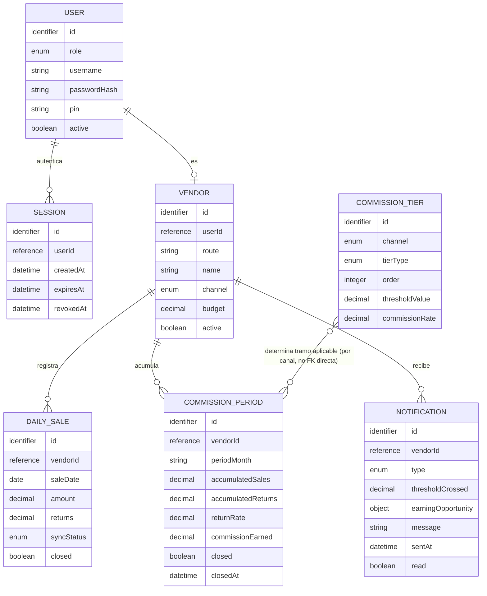

# Functional Design — backend-api — Functional Spec

## Sources

- [upstream:unit-of-work] `inception/units-generation/unit-of-work.md` — confirma el alcance de `backend-api` como unidad `service` (dueña de la lógica de negocio real: cálculo de comisión, validación, persistencia), el límite que estructura los workflows de este documento.
- [upstream:unit-of-work-story-map] `inception/units-generation/unit-of-work-story-map.md`
- [upstream:entities] `construction/backend-api/functional-design/entities.md`
- [upstream:rules] `construction/backend-api/functional-design/rules.md`
- [upstream:contract-summary] `inception/contract-design/contract-summary.md`

Fuente de verdad de los flujos de trabajo (secuencia de pasos numerados) y de las transiciones de estado de las entidades con ciclo de vida — `entities.md` fija la forma, `rules.md` la lógica de decisión; ninguno de los dos captura la secuencia ordenada de un caso de uso ni el ciclo de vida de una entidad, que es lo que este documento aporta. Cubre las 21 historias de `unit-of-work-story-map.md` asignadas a `backend-api`.

## Workflows

### W1 — Login de vendedor (US1.1)

1. Vendedor envía `POST /api/v1/auth/login/vendedor` con `username` + `password`.
2. Backend busca `User` con `username` dado y `role=vendedor`.
3. IF no existe, o `passwordHash` no coincide THEN responder `401` (sin distinguir "usuario no existe" de "contraseña incorrecta" — no revelar cuál de los dos falló).
4. IF coincide THEN crear una `Session` nueva (`userId`, `createdAt=ahora`, `expiresAt=null` — BR1.4) y responder `200` con `{ token, userId, role: vendedor }`.

### W2 — Login de supervisor (US1.3)

1. Supervisor envía `POST /api/v1/auth/login/supervisor` con `pin`.
2. Backend busca `User` con `pin` dado y `role=supervisor`, `active=true`.
3. IF no existe coincidencia THEN responder `401`.
4. IF coincide THEN crear una `Session` nueva (`expiresAt=null` — BR1.5) y responder `200` con `{ token, userId, role: supervisor }`.

### W3 — Cierre de sesión (US1.2)

1. Usuario autenticado (vendedor o supervisor) envía `POST /api/v1/auth/logout` con su token vigente.
2. Backend resuelve la `Session` del token (BR1.1 de `api-contract`); marca `revokedAt=ahora`.
3. Responder `204`. Cualquier petición posterior con ese token se rechaza con `401` (la `Session` revocada ya no autentica — regla de entidad de `entities.md`).

### W4 — Gestión de roster y presupuesto (US2.1, US2.2)

1. Supervisor autenticado envía `POST /api/v1/vendors` o `PATCH /api/v1/vendors/{vendorId}` con `route`, `name`, `channel`, `budget`.
2. Backend valida rol supervisor (BR1.2 de `api-contract`) y forma/presupuesto (BR2.1 de `api-contract`).
3. IF es creación THEN crear el `User` (`role=vendedor`) y el `Vendor` asociado; IF es edición de un `Vendor` existente cuyo `budget` cambió THEN disparar BR4.4 (recálculo completo) sobre su `CommissionPeriod` vigente.
4. Responder `201`/`200` con el `Vendor` resultante.

### W5 — Gestión de tramos de comisión (US2.3)

1. Supervisor autenticado envía `PUT /api/v1/tiers` con el conjunto completo de tramos de un canal.
2. Backend valida rol supervisor y forma de cada tramo (BR1.2, BR2.2 de `api-contract`).
3. Reemplazar el conjunto de `CommissionTier` de ese canal; determinar si el conjunto guardado queda "en orden" (de mejor a peor beneficio según `tierType`) — advertencia `TIER_ORDER_WARNING` si no, sin bloquear (ADR-003, BR2.3 de `api-contract`).
4. Para cada `Vendor` de ese canal, disparar BR4.4 (recálculo completo) sobre su `CommissionPeriod` vigente — un cambio de tramos afecta el cálculo hacia adelante, sin snapshot retroactivo (Q5).
5. Responder `200` con `{ tiers, inOrder, warning }`.

### W6 — Registrar o corregir venta del día, con conexión (US3.1, US3.2)

1. Vendedor autenticado envía `POST /api/v1/sales` con `saleDate`, `amount`, `returns`.
2. Backend valida forma (BR3.1 de `api-contract`: monto/devoluciones no negativos).
3. Backend busca `DailySale` existente para `(vendorId de la sesión, saleDate)`.
4. IF existe y `closed=true` THEN responder `409` (BR3.2 de `api-contract`) — no se modifica.
5. IF existe y `closed=false` THEN actualizar `amount`/`returns` (corrección del mismo día, FR3.3); IF no existe THEN crear el registro con `syncStatus=synced`.
6. Disparar BR4.4 (recálculo completo) sobre el `CommissionPeriod` vigente del vendedor.
7. Evaluar BR7.1/BR7.2 (umbral de venta) y BR8.2/BR8.3 (umbral de devolución) sobre el `CommissionPeriod` recalculado; enviar las `Notification` que correspondan.
8. Responder `200` con el `DailySale` guardado.

### W7 — Sincronizar ventas guardadas offline (US3.3)

1. Vendedor autenticado envía `POST /api/v1/sales/sync` con un arreglo de `{ saleDate, amount, returns }`, cada una de un día distinto (una app cliente nunca envía dos ítems de la misma fecha en un mismo lote — se asume la fecha como clave natural del dispositivo, ADR-004).
2. Para cada ítem, en el orden recibido:
   a. Validar forma (BR3.1 de `api-contract`); si inválido, marcar `status=rejected` con el `Error` correspondiente y continuar con el siguiente ítem.
   b. Resolver si `(vendorId, saleDate)` cae en un `CommissionPeriod` cerrado (BR3.4); si sí, marcar `status=rejected` con `Error.code=PERIOD_CLOSED` y continuar.
   c. IF ya existe un `DailySale` para esa fecha (por ejemplo, sincronizado antes por otro dispositivo — BR3.5) THEN sobrescribirlo; ELSE crearlo, con `syncStatus=synced`.
   d. Marcar ese ítem `status=applied` en la respuesta.
3. Tras procesar todo el lote, disparar BR4.4 una sola vez por vendedor (no una vez por ítem) para evitar recálculos redundantes, y evaluar BR7.1/BR7.2/BR8.2/BR8.3 sobre el resultado final.
4. Responder `200` con el arreglo de resultados por ítem, en el mismo orden recibido.

### W8 — Reporte en tiempo real y comisión vigente (US4.1, US5.1, US5.2, US5.3)

1. Vendedor autenticado envía `GET /api/v1/commission/current`.
2. Backend resuelve el `CommissionPeriod` vigente (`closed=false`) del vendedor de la sesión — si no existe todavía (primer uso), se crea uno en cero al vuelo (misma garantía que BR4.5 provee al cambiar de mes).
3. Responder `200` con `commissionEarned`, `accumulatedSales`, `accumulatedReturns`, `returnRate`, y `budgetProgress` calculado como `accumulatedSales / Vendor.budget × 100`.
4. "Tiempo real" (FR5.3) se logra porque W6/W7 ya recalcularon el `CommissionPeriod` en el momento de guardar/sincronizar (BR4.4) — este endpoint solo lee el valor ya vigente, sin recalcular de nuevo ni exigir refresco manual del lado del cliente.

### W9 — Cierre de período mensual (US4.2)

1. El job programado (BR4.5) se dispara automáticamente el último día del mes.
2. Para cada `Vendor` activo: cerrar su `CommissionPeriod` vigente (`closed=true`, `closedAt=ahora`) y crear el `CommissionPeriod` del mes siguiente en cero, si no existe aún.
3. Ningún efecto secundario de notificación se dispara por el cierre en sí — las notificaciones ya se enviaron durante el mes, a medida que se cruzaban umbrales (W6/W7); el cierre solo fija el valor final para el historial.

### W10 — Consultar historial (US6.1)

1. Vendedor autenticado envía `GET /api/v1/commission/history?limit=N`.
2. Backend aplica BR6.1: filtrar `CommissionPeriod` del vendedor con `closed=true`, ordenar por `periodMonth` descendente, aplicar `limit` si se especifica.
3. Responder `200` con el arreglo resultante.

### W11 — Notificación de umbral de venta/presupuesto (US7.1)

Disparado como efecto secundario de W6/W7 (paso de evaluación de umbrales), nunca por una petición directa del cliente:

1. Tras un recálculo de `CommissionPeriod`, evaluar BR7.1 para cada uno de los 6 umbrales de presupuesto.
2. Para cada umbral recién cruzado y no notificado aún en el período vigente (BR7.2), crear una `Notification(type=umbral_venta)` y encolarla para envío push.
3. Responder no aplica (es un efecto secundario dentro de la respuesta de W6/W7, no un endpoint propio).

### W12 — Indicador de devolución y notificación con oportunidad de ganancia (US8.1, US8.2, US8.3)

Disparado como efecto secundario de W6/W7:

1. Tras un recálculo de `CommissionPeriod`, calcular `returnRate` (BR8.1).
2. Evaluar BR8.2 para cada uno de los 6 umbrales de devolución.
3. Para cada umbral recién cruzado y no notificado aún, construir la `Notification(type=umbral_devolucion)`, aplicando BR8.3 para incluir u omitir `earningOpportunity` según si los tramos de devolución del canal están en orden.
4. Encolar la `Notification` para envío push.

### W13 — Notificación manual del supervisor (US9.1)

1. Supervisor autenticado envía `POST /api/v1/notifications/manual` con `message` + `recipients`.
2. Backend valida rol supervisor (BR1.3 de `api-contract`) y forma (BR9.1 de `api-contract`).
3. Resolver destinatarios según BR9.2 (`all` → todo `Vendor` activo; lista → solo los que resuelven a un `Vendor` activo).
4. Para cada destinatario resuelto, crear una `Notification(type=manual)` y encolarla para envío push.
5. Responder `202` — la entrega push es asíncrona; el endpoint no espera confirmación de entrega de cada dispositivo.

## State Machines

### Session

```
[no existe] --(login vendedor/supervisor exitoso, W1/W2)--> ACTIVA
ACTIVA --(logout explícito, W3)--> REVOCADA
ACTIVA --(revocación manual por supervisor — fuera de alcance de un endpoint en este MVP)--> REVOCADA
REVOCADA --(terminal)--> REVOCADA
```

Ninguna transición por expiración de tiempo existe en este MVP (BR1.4, BR1.5) — a diferencia de un diseño típico de sesión, no hay arista `ACTIVA --(timeout)--> EXPIRADA`.

### DailySale

```
[no existe] --(W6 paso 5, primer registro del día)--> ABIERTA (closed=false, syncStatus=synced)
[no existe] --(W7 paso 2c, primera sincronización offline)--> ABIERTA (closed=false, syncStatus=synced)
ABIERTA --(W6 paso 5, corrección del mismo día)--> ABIERTA
ABIERTA --(W7 paso 2c, sincronización de otro dispositivo, BR3.5)--> ABIERTA (sobrescrita)
ABIERTA --(W9, cierre de período mensual)--> CERRADA (closed=true)
CERRADA --(W6, intento de corrección directa)--> rechazado 409, sin transición (BR3.2 de api-contract)
CERRADA --(W7, intento de sincronización a esa fecha)--> rechazado con PERIOD_CLOSED, sin transición (BR3.4)
CERRADA --(terminal)--> CERRADA
```

### CommissionPeriod

```
[no existe] --(primera DailySale del mes, o W8 al vuelo, o W9 al abrir el mes siguiente)--> VIGENTE (closed=false)
VIGENTE --(W6/W7, cualquier cambio de DailySale del período)--> VIGENTE (recalculado por completo, BR4.4)
VIGENTE --(W4/W5, cambio de budget o tramos del vendedor)--> VIGENTE (recalculado por completo, BR4.4)
VIGENTE --(W9, cierre de período mensual)--> CERRADO (closed=true, closedAt fijado)
CERRADO --(terminal — expuesto en historial, W10)--> CERRADO
```

## Diagrama ER (derivado de `entities.md`)



Texto alternativo (si el renderizado de mermaid falla): User 1—N Session; User 1—0..1 Vendor; Vendor 1—N DailySale; Vendor 1—N CommissionPeriod; Vendor 1—N Notification; CommissionTier se relaciona con CommissionPeriod por canal/tierType en tiempo de cálculo, no por referencia directa de clave foránea.

## Resumen de reglas (derivado de `rules.md`)

| ID | Qué decide |
|---|---|
| BR1.4 / BR1.5 | Ninguna sesión expira por tiempo (vendedor ni supervisor) |
| BR3.4 | Sincronizar a un período cerrado se rechaza (`PERIOD_CLOSED`) |
| BR3.5 | Conflicto de dos dispositivos offline: último en sincronizar gana |
| BR4.1–BR4.3 | Métrica por canal → tramo aplicable → fórmula de comisión |
| BR4.4 | Recálculo completo, nunca incremental |
| BR4.5 | Cierre de período mensual por job programado |
| BR6.1 | Historial: solo cerrados, más recientes primero |
| BR7.1 / BR7.2 | Umbral de venta: detección y no-reenvío |
| BR8.1–BR8.3 | Indicador de devolución, detección de umbral, oportunidad de ganancia condicional |
| BR9.2 | Resolución de destinatarios de notificación manual |

## Review

**Verdict:** READY
**Reviewer:** aidlc-architecture-reviewer-agent
**Date:** 2026-09-08T21:12:00Z
**Iteration:** 1
**Request Challenge:** review:3157b433ae0cbde507d23b83e7c6bcec

### Nota de esta iteración

Reapertura administrativa del gate (recuperación de un desajuste de seguimiento interno del motor, sin relación con la calidad del contenido). El único cambio de contenido desde la revisión original es agregar la cita faltante de `unit-of-work.md` en `## Sources` (el sensor `upstream-coverage` señaló que ese archivo, parte de `consumes[]` de esta etapa, no estaba citado por nombre en ningún archivo producido). Los tres hallazgos y el veredicto READY de la revisión original se mantienen sin cambios — ver abajo.

### Findings

| ID | Severity | Location | Finding | Required action | Status |
|---|---|---|---|---|---|
| R-01 | Minor | `functional-spec.md` W4 paso 3 | El disparador de BR4.4 se redacta como "si `budget` cambió", pero un cambio de `channel` a mitad de mes también debería disparar recálculo (cambia qué tramos aplican, BR4.1) — el efecto es el mismo recálculo completo (BR4.4), así que esto es una corrección de redacción, no un cambio de diseño | No bloquea: ampliar el paso 3 de W4 a "si `budget` o `channel` cambió" en Code Generation | New |
| R-02 | Minor | `functional-spec.md` W6 vs. W7 (no documentado explícitamente) | Un vendedor con conexión intermitente podría disparar W6 (online) y W7 (sync de backlog offline) para la misma fecha casi simultáneamente; BR3.5 solo nombra el conflicto entre dos sincronizaciones offline (W7 vs. W7). En la práctica ambos caminos convergen en el mismo `(vendorId, saleDate)` único (constraint de `entities.md`) y el motor de persistencia resuelve con la misma semántica de "última escritura gana" que BR3.5 ya aceptó como riesgo | No bloquea: documentar explícitamente en Code Generation que BR3.5 también cubre el cruce W6-vs-W7, dado que el patrón de uso real (un dispositivo por vendedor) hace este cruce improbable | New |
| R-03 | Minor | `rules.md` BR8.2 / `entities.md` Notification | La regla de no-duplicación de umbral de devolución vive dentro de la lógica de BR8.2 (sin un id de regla separado, a diferencia de BR7.1/BR7.2 que sí lo separan) — es asimétrico con el par BR7.1/BR7.2 pero no crea ambigüedad porque BR8.2 documenta la no-duplicación explícitamente en su propio `logic` | No bloquea: es una preferencia de estilo entre unidades de regla, no un hueco funcional; no requiere acción |New |

### Validation Tool Results

| Tool | Result | Interpretation |
|---|---|---|
| `bun .claude/tools/aidlc-sensor-traceability.ts --output-path .../traceability.json --stage-slug functional-design` | PASS: `{"pass":true,"gaps":[],"orphans":[],...}` | Las 38 ACs de las 21 historias asignadas a `backend-api` están cubiertas (OK o N/A justificado) y las 16 BR propias de esta unidad están todas referenciadas o explicadas en `reverse` |
| Verificación cruzada BRx.y de `rules.md` vs. `entities.md`/`functional-spec.md` | PASS (manual) | Cada regla citada en los 13 workflows (`W1`-`W13`) y en las 3 máquinas de estado existe en `rules.md`; ningún id inventado |
| Verificación de continuidad de numeración BR con `api-contract` | PASS (manual) | BR1.4/BR1.5 continúan el grupo 1, BR3.4/BR3.5 el grupo 3, sin colisión con BR1.1-BR1.3/BR3.1-BR3.3 ya usados por `api-contract` |

### Summary

Los 13 workflows cubren las 21 historias asignadas a `backend-api` sin huecos, las 3 máquinas de estado son completas (todo estado alcanzable, sin callejones sin salida no documentados), y las 16 reglas de `rules.md` están correctamente referenciadas y son mutuamente consistentes entre sí y con `entities.md`. Los tres hallazgos son menores — dos de redacción/documentación (R-01, R-02) y uno de estilo entre unidades de regla (R-03) — ninguno bloquea: un desarrollador podría implementar `backend-api` a partir de este documento sin preguntarle al arquitecto.

