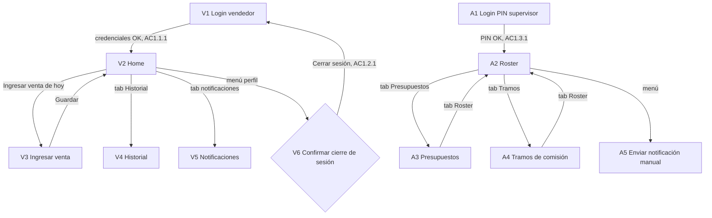

# Functional Design — mobile-app — Especificación Funcional

## Sources

- [upstream:unit-of-work] `inception/units-generation/unit-of-work.md`
- [upstream:unit-of-work-story-map] `inception/units-generation/unit-of-work-story-map.md`
- [upstream:requirements] `inception/requirements-analysis/requirements.md`
- [upstream:mockups] `inception/refined-mockups/mockups.md`
- [upstream:design-system-mapping] `inception/refined-mockups/design-system-mapping.md`
- [upstream:accessibility-checklist] `inception/refined-mockups/accessibility-checklist.md`
- [upstream:contract-summary] `inception/contract-design/contract-summary.md`
- [upstream:backend-functional-spec] `construction/backend-api/functional-design/functional-spec.md`
- [upstream:backend-rules] `construction/backend-api/functional-design/rules.md`
- [Q1] `functional-design-questions.md` — almacenamiento local: `expo-sqlite`
- [Q2] `functional-design-questions.md` — sincronización automática en segundo plano
- [Q3] `functional-design-questions.md` — detección de conectividad: `@react-native-community/netinfo`
- [Q4] `functional-design-questions.md` — notificaciones: `expo-notifications` + badge optimista
- [Q5] `functional-design-questions.md` — sesión: `expo-secure-store` + logout silencioso ante 401

`mobile-app` es una unidad `ui` (kind `ui` en `unit-of-work.md`): no produce `entities.md` ni `rules.md` propios — la lógica de negocio y el modelo de datos son responsabilidad de `backend-api` (ver su `rules.md`, ids `BRx.y`). Este documento es autocontenido: especifica las 11 pantallas de `mockups.md` (V1-V6 app del vendedor, A1-A5 panel del administrador), sus flujos de interacción, sus transiciones de estado, y cómo cada una consume el contrato de `api-contract` (`inception/contract-design/contract-summary.md`) — sin duplicar ninguna regla de cálculo o validación real, solo la UX inmediata (campos vacíos, formato) que `mockups.md` ya especifica.

## Mapa de navegación



## Decisiones de esta etapa (Q1-Q5)

| Decisión | Detalle | Referencia |
|---|---|---|
| Almacenamiento local | `expo-sqlite`, tabla `pending_sales(saleDate TEXT PK, amount REAL, returns REAL, createdAt TEXT, syncAttempts INTEGER)` | Q1 |
| Sincronización | Automática al detectar reconexión; sin acción del usuario; indicador visual (↻) durante el intento | Q2 |
| Conectividad | `@react-native-community/netinfo`, listener global montado en el layout raíz de la app | Q3 |
| Notificaciones | `expo-notifications`; badge local incrementado al recibir push, reconciliado con `GET /api/v1/notifications` al abrir V5 | Q4 |
| Sesión | Token en `expo-secure-store`; interceptor HTTP global detecta 401 → logout silencioso → redirige a V1/A1 según el rol de la sesión perdida | Q5 |

## Workflows por pantalla

### MW1 — Login del vendedor (V1) [US1.1, AC1.1.1, AC1.1.2, AC1.1.3]

1. El vendedor ingresa `username`/`password`; botón "Ingresar" deshabilitado hasta que ambos campos tengan contenido (regla de UX inmediata, no de negocio).
2. Al tocar "Ingresar": estado `loading` (spinner en el botón), `POST /api/v1/auth/login/vendedor` (Contrato 1).
3. **200**: guarda `token`/`userId`/`role` en `expo-secure-store` (Q5), navega a V2 (Home). Cumple AC1.1.1.
4. **401**: estado `error` — banner inline "Usuario o contraseña incorrectos" bajo los campos; los campos no se limpian; el usuario puede reintentar sin restricción de la UI (el throttling de intentos es responsabilidad de `backend-api`, `login-throttler.guard.ts`). Cumple AC1.1.2.
5. La sesión persiste sin acción adicional del vendedor mientras el token siga siendo válido — no hay expiración programática del lado del cliente (AC1.1.3); ver MW9 para el caso de revocación del lado del servidor.

### MW2 — Login del supervisor por PIN (A1) [US1.3, AC1.3.1, AC1.3.2]

1. Input numérico tipo PIN (4 dígitos); botón "Ingresar" deshabilitado hasta 4 dígitos ingresados.
2. `POST /api/v1/auth/login/supervisor` (Contrato 1).
3. **200**: guarda sesión (rol `supervisor`), navega a A2 (Roster). Cumple AC1.3.1.
4. **401**: banner inline "PIN incorrecto", no bloquea reintento. Cumple AC1.3.2.

### MW3 — Cierre de sesión (V6) [US1.2, AC1.2.1]

1. Desde el menú de perfil de Home (V2) o del header del panel de administración, el usuario toca "Cerrar sesión".
2. Diálogo de confirmación (`Dialog` de Paper, dos acciones: Cancelar / Cerrar sesión).
3. Si confirma: `POST /api/v1/auth/logout` (Contrato 1, best-effort — si falla por falta de red, el logout local procede igual, ya que el objetivo es que el vendedor salga de su cuenta en este dispositivo, no que el servidor se entere de inmediato), borra el token de `expo-secure-store`, limpia el estado local no persistente (mantiene `pending_sales` intacta, ver Q1 — no se pierden ventas sin sincronizar por cerrar sesión), navega a V1 o A1 según el rol. Cumple AC1.2.1.

### MW4 — Ver comisión, venta acumulada e indicador de devolución (V2 Home) [US5.1, US5.2, US5.3, AC5.1.1, AC5.2.1, AC5.3.1]

1. Al entrar a Home o al reabrir la app con sesión activa: estado `loading` (skeleton de la card), `GET /api/v1/commission/current` (Contrato 5).
2. **200**: muestra comisión ganada (`commissionEarned`, dato más prominente — `typography.headlineLarge`), venta acumulada vs. presupuesto (`accumulatedSales`/`budgetProgress`, `ProgressBar` con color dinámico), indicador de devolución (`returnRate`) con badge verde si mejoró respecto al valor mostrado en la carga anterior de la sesión. Cumple AC5.1.1, AC5.2.1.
3. **Error de red**: banner "No se pudo cargar tu comisión, desliza para reintentar" (`pull-to-refresh`).
4. **Actualización en tiempo real** (AC5.3.1): después de MW6 (guardar venta con conexión) o de una sincronización exitosa (MW8), Home vuelve a pedir `GET /api/v1/commission/current` sin que el vendedor tenga que refrescar manualmente — el estado global de la app (ej. React Query / contexto de sesión) invalida la consulta de comisión vigente como efecto directo de esas dos operaciones.
5. Si hay ventas en `pending_sales` (Q1) sin sincronizar, se muestra el ícono ↻ junto al monto (ver MW7/MW8).

### MW5 — Ingresar venta del día, pantalla de carga (V3, estado inicial) [US3.1, US3.2, US3.3]

1. Al abrir V3: `GET /api/v1/commission/current` no aplica aquí (esa es Home); en su lugar la pantalla determina su propio estado inicial consultando primero `pending_sales` local (Q1) por la fecha de hoy y, si hay conexión (Q3), intentando obtener el estado del día vigente desde el servidor (no hay un endpoint dedicado de "venta de hoy"; el estado se deriva de si ya existe una venta local pendiente o ya sincronizada para la fecha de hoy).
2. Si ya existe una venta de hoy (local o ya conocida por una sincronización previa): el formulario carga precargado con el monto/devoluciones existentes, en modo edición (AC3.2.1).
3. Si el día ya cerró (dato no disponible del lado del cliente sin backend — se infiere de una respuesta `409 PERIOD_CLOSED` en un intento de guardado previo, o de que `backend-api` lo indique en una respuesta futura del contrato): formulario de solo lectura con aviso "Este día ya cerró" (AC3.2.2).
4. Si no hay conexión (Q3): banner informativo "↻ Sin conexión: se guardará localmente y sincronizará cuando vuelva la señal" — el flujo de guardado (MW7) no cambia.

### MW6 — Guardar venta, con conexión (V3) [US3.1, US3.2, AC3.1.1, AC3.1.2, AC3.2.1, AC3.2.2]

1. El vendedor ingresa "Monto vendido" (obligatorio, > 0) y "Devoluciones" (opcional); botón "Guardar venta" deshabilitado si el monto está vacío o ≤ 0 (validación de UX inmediata, banner "⚠ Ingresa un monto válido (mayor a 0)" visible solo tras un intento de guardado inválido).
2. Al tocar "Guardar" con conexión disponible: `POST /api/v1/sales` (Contrato 4, idempotente por fecha).
3. **200**: la venta queda registrada/corregida; navega de vuelta a V2 (Home), que se refresca (MW4 paso 4). Cumple AC3.1.1 (recalculo en <2s es responsabilidad de `backend-api`, NFR1.1; la UI solo debe evitar introducir latencia perceptible propia — sin transformación pesada en el cliente antes de enviar). Cumple AC3.2.1 (corrección del mismo día).
4. **400**: banner inline de validación bloqueante — no navega, el vendedor corrige y reintenta. Cumple AC3.1.2.
5. **409** (`PERIOD_CLOSED`): el formulario pasa a solo lectura con el aviso de MW5 paso 3 — no se pierde lo que el vendedor tenía escrito, pero no se puede guardar. Cumple AC3.2.2.

### MW7 — Guardar venta, sin conexión (V3) [US3.3, AC3.3.1, AC3.3.4]

1. Mismo formulario y validación de UX que MW6. Al tocar "Guardar" sin conexión (detectada por Q3) — o si la conexión se pierde a mitad del intento de `POST /api/v1/sales` de MW6 (timeout o error de red, AC3.3.4) —, la app NO muestra un error de pérdida de datos: guarda o actualiza la fila correspondiente a la fecha de hoy en `pending_sales` (upsert local por `saleDate`, mismo criterio de idempotencia que el contrato usa del lado del servidor) con `syncAttempts=0`.
2. Muestra confirmación visual de que la venta quedó guardada localmente pendiente de sincronizar (mismo resultado percibido por el vendedor que un guardado exitoso — no debe sentirse como un error), navega a V2 (Home), que muestra el ícono ↻ (MW4 paso 5). Cumple AC3.3.1.
3. Editar una venta ya guardada localmente pendiente (mismo día): sobrescribe la fila local existente en `pending_sales`, no crea una segunda entrada — el mismo comportamiento de "última edición gana" que MW6 aplica del lado del servidor.

### MW8 — Sincronización automática al recuperar conexión [US3.3, AC3.3.2, AC3.3.3]

1. El listener de `@react-native-community/netinfo` (Q3) detecta la transición de sin-conexión a con-conexión.
2. Si `pending_sales` (Q1) tiene una o más filas: `POST /api/v1/sales/sync` (Contrato 4) con el arreglo completo de filas pendientes, cada una con su propia `saleDate` — cubre el caso de varios días acumulados sin conexión (AC3.3.3), delegando en `backend-api` (W7, BR3.4/BR3.5) la resolución de cierre de período y conflictos por fecha.
3. Respuesta: un resultado por ítem (`applied` / `rejected` con `error`). Cada ítem `applied` se elimina de `pending_sales`; cada ítem `rejected` permanece en `pending_sales` marcado con el motivo del rechazo (ej. `PERIOD_CLOSED`) para que el vendedor lo vea reflejado si vuelve a abrir V3 para esa fecha, en vez de reintentarse indefinidamente. Cumple AC3.3.2 (sin pérdida ni duplicación: cada fila se identifica por fecha única, igual que el servidor).
4. Si la sincronización en sí falla por red (no llegó a completarse), `pending_sales` no cambia y se reintenta en el próximo evento de reconexión o al reabrir la app — sin acción del vendedor (Q2).
5. Al finalizar una sincronización con al menos un ítem `applied`, Home se refresca (MW4 paso 4).

### MW9 — Sesión revocada inesperadamente [FR1.4, AC1.1.3, Q5]

1. Cualquier respuesta HTTP `401` de cualquier endpoint (fuera del propio login) es interceptada globalmente.
2. La app borra el token de `expo-secure-store`, preserva `pending_sales` intacta (Q1 — las ventas no sincronizadas no se pierden por un logout forzado), y navega a V1 o A1 (según el último rol conocido) con un mensaje "Tu sesión expiró, ingresa de nuevo".
3. Al volver a iniciar sesión exitosamente, la sincronización de MW8 se dispara de inmediato si `pending_sales` tiene filas, sin esperar un nuevo evento de reconexión de red.

### MW10 — Consultar historial (V4) [US6.1, AC6.1.1]

1. Al entrar a V4: estado `loading` (skeleton de 3 filas), `GET /api/v1/commission/history` (Contrato 5).
2. **200** con resultados: lista de períodos cerrados, más reciente primero, de solo lectura (venta y comisión de cada mes). Cumple AC6.1.1.
3. **200** vacío: estado `empty` — "Aún no tienes períodos cerrados".

### MW11 — Ver y gestionar notificaciones (V5) [US7.1, US8.2, US8.3, US9.1, AC7.1.1, AC7.1.2, AC7.1.3, AC8.2.1, AC8.2.2, AC8.3.1, AC8.3.2]

1. Recepción de push en foreground/background vía `expo-notifications` (Q4): incrementa el badge local de la pestaña "🔔" inmediatamente (señal optimista).
2. Al abrir V5: `GET /api/v1/notifications` (Contrato 6) — fuente de verdad; la lista recibida reconcilia (reemplaza) el conteo optimista del badge, y el badge se limpia (marca todo como visto en este dispositivo).
3. Agrupación en cliente por `type` (`umbral_venta`, `umbral_devolucion`, `manual`) en tres secciones (`List.Section`), cada grupo ordenado por `sentAt` descendente — la agrupación es una decisión de presentación de esta pantalla, no del backend, que entrega la lista plana.
4. Cada notificación de `type=umbral_devolucion` que incluya `earningOpportunity` (no nulo) muestra el texto de oportunidad de ganancia ("podrías ganar $X más si llegas a Y%") tal como lo entrega el backend — la unidad no recalcula ese valor (AC8.3.1). Cuando `earningOpportunity` es `null` (tramos fuera de orden, AC8.3.2 — condición de `backend-api`), la notificación se muestra sin esa línea, sin error visible para el vendedor.
5. Estado `empty`: "Aún no tienes notificaciones".
6. AC7.1.2/AC8.2.2 (no reenvío de umbral ya notificado) y AC7.1.3 (recálculo al editar presupuesto a mitad de mes) son responsabilidad exclusiva de `backend-api` (qué se envía); esta pantalla solo muestra lo que recibe, sin lógica de deduplicación propia.

### MW12 — Gestión del roster (A2) [US2.1, AC2.1.1, AC2.1.2]

1. Al entrar a A2: `GET /api/v1/vendors` (Contrato 2), estado `loading` (skeleton).
2. "+ Agregar": formulario con ruta/nombre/canal (sin campo de presupuesto — se gestiona en A3, ver Q4 de `code-generation-plan.md` de `backend-api` sobre credenciales auto-generadas); `POST /api/v1/vendors`. **201**: agrega a la lista. **400**: banner de validación. Cumple AC2.1.1.
3. Edición (ícono lápiz por fila): `PATCH /api/v1/vendors/{vendorId}`. **200**: refleja el cambio en la lista, indicando que aplica desde el período vigente en adelante (texto informativo, la regla de "desde cuándo aplica" es de `backend-api`). Cumple AC2.1.2.

### MW13 — Gestión de presupuestos (A3) [US2.2, AC2.2.1, AC2.2.2]

1. Misma lista que A2 (TabBar compartido), con edición inline de "Presupuesto" por fila.
2. Guardar: `PATCH /api/v1/vendors/{vendorId}` con el nuevo `budget`. **200**: valor actualizado, usado por `backend-api` para el % de avance del vendedor. Cumple AC2.2.1.
3. **400**: banner "⚠ El presupuesto debe ser mayor a 0" inline, botón "Guardar" deshabilitado hasta corregir (mismo patrón de MW6). Cumple AC2.2.2.

### MW14 — Gestión de tramos de comisión (A4) [US2.3, AC2.3.1, AC2.3.2]

1. Selector de canal (Preventa/Autoventa); al cambiar: `GET /api/v1/tiers?channel=...` (Contrato 3).
2. Lista editable de tramos en orden visual (mejor a peor beneficio, de arriba hacia abajo, según mockups.md). "+ Agregar tramo" / edición inline de umbral y comisión por tramo.
3. Guardar (reemplaza el conjunto completo del canal): `PUT /api/v1/tiers`. Cumple AC2.3.1.
4. **200** con `warning="TIER_ORDER_WARNING"`: el guardado se completa igual (no se bloquea, per ADR-003 de `backend-api`/domain-design), pero la pantalla muestra el banner "⚠ Los tramos deben quedar ordenados de menor a mayor beneficio para que la app calcule bien la oportunidad de ganancia" (no bloqueante, informativo). Cumple AC2.3.2.
5. **400**: umbral o comisión vacíos/negativos — banner de validación bloqueante, no guarda.

### MW15 — Enviar notificación manual (A5) [US9.1, AC9.1.1, AC9.1.2, AC9.1.3]

1. Selector de modo (`RadioButton.Group`): Un vendedor / Varios vendedores / Todos los vendedores. Si "Un"/"Varios": selector de vendedores (`Checkbox.Item`, lista del roster ya cargado en A2).
2. Campo de mensaje (`TextInput` multilínea); botón "Enviar notificación" deshabilitado si el mensaje está vacío o no hay destinatarios seleccionados (validación de UX inmediata).
3. Al enviar: `POST /api/v1/notifications/manual` con `recipients` = lista de `vendorId` (modo Un/Varios) o `"all"` (modo Todos).
4. **202**: confirmación breve "Notificación enviada a N vendedores". Cumple AC9.1.1 (Un/Varios), AC9.1.2 (Todos).
5. **400**: banner "⚠ Escribe un mensaje antes de enviar" inline, no envía. Cumple AC9.1.3.

## Máquinas de estado

### Estado de sesión (transversal a toda la app)

```
[sin sesión] --(MW1/MW2 login exitoso)--> [con sesión, rol=vendedor|supervisor]
[con sesión] --(MW3 logout explícito)--> [sin sesión]
[con sesión] --(MW9, 401 inesperado)--> [sin sesión, con mensaje "sesión expiró"]
```

### Estado de una fila de `pending_sales` (Q1, local)

```
[no existe] --(MW7, guardado sin conexión)--> pending (syncAttempts=0)
pending --(MW7, edición del mismo día antes de sincronizar)--> pending (sobrescrita)
pending --(MW8, POST /sales/sync → applied)--> [eliminada de pending_sales]
pending --(MW8, POST /sales/sync → rejected)--> rejected (visible en V3 si el vendedor reabre esa fecha)
```

### Estado del formulario de venta (V3)

```
default --(carga inicial, MW5)--> precargado (si ya existe venta de hoy) | vacío (si no existe)
default/precargado --(intento de guardado inválido)--> error-validación (banner + botón deshabilitado)
default/precargado --(guardado válido, con conexión, MW6)--> [vuelve a Home]
default/precargado --(guardado válido, sin conexión o fallo de red, MW7)--> [vuelve a Home, con ↻]
cualquiera --(backend responde 409 PERIOD_CLOSED)--> solo-lectura ("Este día ya cerró")
```

## Manejo de errores (transversal)

- Toda petición HTTP pasa por un interceptor único: `401` → MW9 (logout silencioso); error de red/timeout → según la pantalla, se trata como el caso "sin conexión" de esa pantalla (nunca un error genérico sin contexto) cuando la pantalla tiene un comportamiento offline definido (V3/V2), o un banner de reintento cuando no lo tiene (V4, V5, A2-A5 — no tienen contraparte de trabajo offline en el alcance del MVP, per `unit-of-work.md` § Límites, que acota el modo offline a FR3.4/ingreso de venta).
- Ningún mensaje de error expone detalles técnicos (stack traces, códigos HTTP crudos) al usuario — siempre el texto en español ya definido en `mockups.md` para cada caso.

## Assumptions & Open Questions

None.

## Review

**Verdict:** READY
**Reviewer:** aidlc-architecture-reviewer-agent
**Date:** 2026-09-08T21:20:29Z
**Iteration:** 2
**Request Challenge:** review:d19eb3977c655839745cb38f27033d76

### Nota de esta iteración (2)

Reapertura administrativa del gate: el único cambio de contenido desde la iteración 1 fue mecánico — completar la columna Status (antes vacía) de la tabla de Findings con el valor de enum válido `New` para R-01 a R-04, requerido por el validador de `aidlc-review-brief.ts`. No hay cambio de sustancia en ningún hallazgo, en el veredicto, ni en el resto de la especificación funcional. El veredicto READY y los cuatro hallazgos R-01 a R-04 de la iteración 1 se confirman sin cambios — ver la tabla debajo y el historial completo en `### Historial — iteración 1`.

### Historial — iteración 1

**Date:** 2026-09-08T21:13:00Z
Request Challenge de esa iteración (histórico, no vigente): review:4a38eb4b33f265e304b65acc14300abd

Reapertura administrativa del gate (recuperación de un desajuste de seguimiento interno del motor — pérdida de `runtime-graph.json` — sin relación con la calidad del contenido). Ningún archivo de esta etapa cambió; los cuatro hallazgos R-01 a R-04 y el veredicto READY de la revisión original se mantienen sin cambios — ver abajo. Los cuatro fueron cerrados genuinamente en `code-generation` (clave `(vendorId, saleDate)`, guarda `inFlight` síncrona, `useAutoSync` al montar, `returnRateTrend` persistido).

### Findings

| ID | Severity | Location | Finding | Required action | Status |
|---|---|---|---|---|---|
| R-01 | Minor | MW7/MW8, tabla local `pending_sales` (Q1) | La tabla local no se especifica con `vendorId` como parte de la clave — si un dispositivo llegara a compartirse entre dos vendedores (fuera del patrón de uso asumido de "un dispositivo por vendedor", ya documentado como aceptado en la revisión de `backend-api`), una venta pendiente de un vendedor podría sincronizarse bajo la sesión del siguiente que inicie sesión en ese dispositivo | No bloquea (el patrón de uso real hace esto improbable, mismo tratamiento que el hallazgo equivalente de `backend-api`): Code Generation debe incluir `vendorId` en la clave de `pending_sales` de todos modos, como defensa en profundidad de bajo costo | New |
| R-02 | Minor | MW8, disparo de sincronización | No se especifica una guarda contra sincronización duplicada en vuelo si el listener de `netinfo` emite dos eventos de reconexión casi simultáneos (comportamiento real y conocido de esa librería en transiciones de red inestables) | No bloquea: Code Generation debe agregar un flag de "sincronización en progreso" que descarte un segundo disparo mientras el primero no haya resuelto | New |
| R-03 | Minor | MW8, condición de disparo | La sincronización automática (Q2) solo se especifica como reacción a una *transición* de red observada por `netinfo` durante la sesión activa de la app — no cubre el caso de que el vendedor cierre la app estando sin conexión, con ventas pendientes, y la reabra más tarde ya con conexión disponible desde el arranque (sin que ocurra una transición dentro de esa nueva sesión) | No bloquea: Code Generation debe también intentar sincronizar `pending_sales` al arrancar la app si ya hay conexión disponible en ese momento, no solo ante una transición | New |
| R-04 | Minor | MW4 (V2 Home), indicador de tendencia del indicador de devolución | `returnRateTrend` se calcula solo comparando contra el valor visto dentro de la misma sesión en memoria — en la primera carga tras abrir la app (o tras reinstalarla), no hay un valor previo con qué comparar, por lo que el badge "▼ mejorando" del mockup V2 no podría mostrarse aunque el indicador efectivamente haya mejorado desde la última vez que el vendedor lo vio | No bloquea: Code Generation debe evaluar persistir el último valor de `returnRate` visto localmente (o solicitar al backend un campo de tendencia ya calculado) para que el badge funcione también en la primera apertura de una nueva sesión de la app | New |

### Validation Tool Results

| Tool | Result | Interpretation |
|---|---|---|
| `bun .claude/tools/aidlc-sensor-traceability.ts --output-path .../functional-design/traceability.json --stage-slug functional-design` | PASS: `{"pass":true,"gaps":[],"orphans":[],"missing_from_upstream_ids":[],"invalid_entries":[],"invalid_targets":[],"findings_count":0}` | Las 34 ids de AC asignadas a `mobile-app` están cubiertas (todas `N/A`, justificadas — la lógica real es de `backend-api`, esta unidad implementa la interacción); las 7 reglas de UX inmediata propias de esta unidad (`BR1.6`, `BR1.7`, `BR2.4`-`BR2.6`, `BR3.6`, `BR9.3`) quedan explicadas en `reverse` sin AC propio, sin huérfanos |
| Verificación cruzada `functional-spec.md` (11 pantallas) vs. `mockups.md` (V1-V6, A1-A5) | PASS (manual) | Cada pantalla de `mockups.md` tiene un workflow (`MWx`) correspondiente en `functional-spec.md`; ningún estado documentado en `mockups.md` (loading/error/offline/empty/readonly) queda sin especificar en su workflow |
| Verificación cruzada `functional-spec.md` vs. `contract-summary.md` (6 contratos) | PASS (manual) | Cada llamada a la API mencionada en los workflows corresponde a un endpoint real de `contract-summary.md`, con el método y los códigos de respuesta usados consistentes con el contrato |

### Summary

La especificación funcional de `mobile-app` cubre las 11 pantallas de `mockups.md` con workflows completos, tres máquinas de estado explícitas (sesión, fila de `pending_sales`, formulario de venta) y trazabilidad completa de las 34 ACs asignadas a esta unidad, todas correctamente `N/A` porque la unidad es `ui` y no duplica lógica de negocio de `backend-api`. Los cuatro hallazgos son huecos genuinos de comportamiento en condiciones de borde del modo offline/sincronización y de la UX de tendencia del indicador de devolución — todos razonables de resolver en Code Generation sin requerir un cambio de diseño en esta etapa. Ninguno bloquea — verdict READY.
