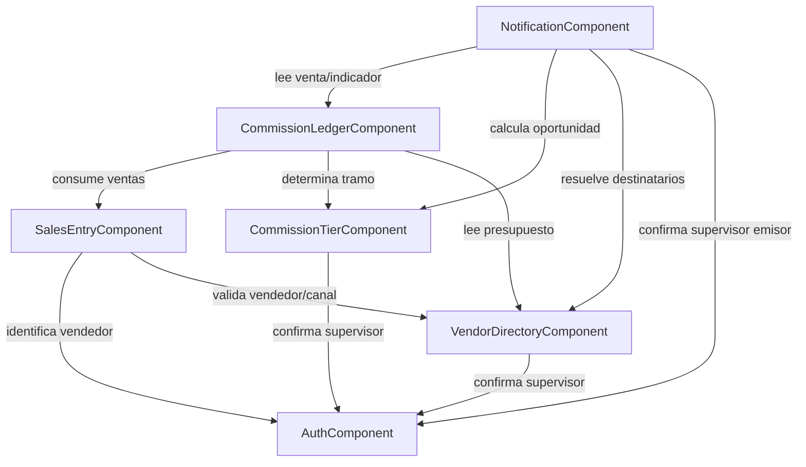

# Domain Design — Component Catalogue

## Sources

- [upstream:requirements] `inception/requirements-analysis/requirements.md`
- [upstream:stories] `inception/user-stories/stories.md`
- [upstream:mockups] `inception/refined-mockups/mockups.md`

```yaml
components:
  - name: AuthComponent
    summary: Autenticación y sesión para vendedor (usuario/contraseña) y supervisor (PIN).
    behaviour: >
      Valida credenciales por rol. Sesión de vendedor de larga duración (varios días)
      con cierre de sesión manual explícito (FR1.4). Sesión de supervisor vía PIN,
      sin duración larga especial definida (se resuelve en Functional Design). El
      modelo de datos soporta más de un supervisor activo aunque el MVP solo active
      uno (FR1.5, NFR7) — el campo de rol y la relación Usuario-Supervisor no asumen
      cardinalidad 1.
    responsibilities:
      - Validar credenciales de vendedor (usuario/contraseña) y supervisor (PIN)
      - Emitir y validar sesión activa por usuario
      - Exponer identidad y rol del llamante a los demás componentes
    depends_on: []
    dependents:
      - component: VendorDirectoryComponent
        interaction: confirmar que quien administra roster/presupuesto es un supervisor autenticado
      - component: CommissionTierComponent
        interaction: confirmar que quien administra tramos es un supervisor autenticado
      - component: SalesEntryComponent
        interaction: resolver qué vendedor autenticado registra la venta
      - component: NotificationComponent
        interaction: resolver destinatario(s) de notificaciones automáticas y confirmar que el envío manual lo origina un supervisor autenticado
    external_dependencies:
      - name: PostgreSQL (Neon)
        kind: database
        purpose: persistencia de usuarios y sesiones
    entities:
      - name: User
        identifier: id
        attributes: [role, username, passwordHash, pin, active]
      - name: Session
        identifier: id
        attributes: [userId, createdAt, expiresAt, revokedAt]

  - name: VendorDirectoryComponent
    summary: Roster de vendedores (ruta, canal) y su presupuesto asignado.
    behaviour: >
      Un solo componente cubre roster y presupuesto porque el presupuesto es un
      atributo mutable del vendedor con el mismo ciclo de vida que su registro
      (decisión del usuario en domain-design-questions Q1). El canal
      (preventa/autoventa) determina qué tipo de tramo (CommissionTierComponent)
      aplica a ese vendedor. Solo el supervisor puede crear/editar vendedores y
      presupuestos; un presupuesto inválido (negativo o vacío) se rechaza (FR2.2,
      AC2.2.2).
    responsibilities:
      - Mantener el roster (ruta, nombre, canal) por vendedor
      - Mantener el presupuesto vigente de cada vendedor
      - Validar presupuesto (rechazar negativo/vacío)
    depends_on:
      - component: AuthComponent
        interaction: confirmar rol supervisor antes de crear/editar
        style: sync
    dependents:
      - component: SalesEntryComponent
        interaction: validar que el vendedor existe y obtener su canal
      - component: CommissionLedgerComponent
        interaction: obtener presupuesto vigente para calcular % de avance y detectar umbrales
      - component: NotificationComponent
        interaction: resolver destinatarios por ruta/canal para notificaciones manuales (FR9.1) y leer el presupuesto vigente para evaluar umbrales de venta
    external_dependencies:
      - name: PostgreSQL (Neon)
        kind: database
        purpose: persistencia de vendedores y presupuestos
    entities:
      - name: Vendor
        identifier: id
        attributes: [userId, route, name, channel, budget, active]
        references:
          - entity: User
            owned_by: AuthComponent
            relationship: "cada Vendor corresponde a exactamente un User con role=vendedor"

  - name: CommissionTierComponent
    summary: Tramos de comisión variable configurados por el supervisor, por canal.
    behaviour: >
      Cada canal usa un tipo de tramo distinto: preventa se evalúa "por devolución",
      autoventa "por efectividad" (heredado de la app "Mi Comisión" y de FR2.3). Los
      tramos deben quedar ordenados de mejor a peor beneficio para que la oportunidad
      de ganancia (FR8.3) tenga un "siguiente tramo mejor" bien definido. Por decisión
      del usuario (Q3), un conjunto de tramos fuera de orden SE GUARDA con una
      advertencia, no se bloquea — por lo tanto este componente expone explícitamente
      si el conjunto vigente de tramos de un canal está "en orden", para que
      NotificationComponent pueda omitir la oportunidad de ganancia cuando no lo esté
      en vez de calcular un valor incorrecto (AC2.3.2, AC8.3.2).
    responsibilities:
      - Mantener los tramos de comisión por canal (umbral, tasa de comisión)
      - Determinar el tramo aplicable dado un valor de venta/efectividad o de devolución
      - Exponer si el conjunto de tramos de un canal está ordenado correctamente
      - Calcular la distancia al "siguiente tramo mejor" (para la oportunidad de ganancia)
    depends_on:
      - component: AuthComponent
        interaction: confirmar rol supervisor antes de crear/editar tramos
        style: sync
    dependents:
      - component: CommissionLedgerComponent
        interaction: determinar el tramo aplicable para calcular la comisión del período
      - component: NotificationComponent
        interaction: calcular la oportunidad de ganancia hacia el siguiente tramo de devolución
    external_dependencies:
      - name: PostgreSQL (Neon)
        kind: database
        purpose: persistencia de tramos
    entities:
      - name: CommissionTier
        identifier: id
        attributes: [channel, tierType, order, thresholdValue, commissionRate]

  - name: SalesEntryComponent
    summary: Registro de la venta diaria del vendedor, online y offline.
    behaviour: >
      Permite ingresar/corregir la venta del día mientras el día está abierto;
      después del cierre del día el valor queda fijo (FR3.3). Valida monto (rechaza
      negativo/vacío, error bloqueante — FR3.2). Soporta guardado sin conexión
      (persistencia local en el dispositivo) con sincronización automática al
      recuperar señal. Por decisión del usuario (Q2), cuando el dispositivo
      acumula más de un día de venta pendiente de sincronizar, cada venta se
      sincroniza de forma independiente por su propia fecha — no requiere un
      proceso de fusión/merge, porque el vendedor ya distinguió la fecha de cada
      una al ingresarla en el dispositivo. Un fallo de red a mitad de la
      operación de guardar (AC3.3.4) se trata igual que un guardado offline
      normal, nunca como un error de pérdida de datos.
    responsibilities:
      - Registrar la venta y devoluciones diarias de un vendedor
      - Validar el monto (bloquear negativos/vacíos)
      - Permitir corrección del mismo día; fijar el valor tras el cierre
      - Persistir localmente y sincronizar ventas pendientes por fecha, sin pérdida ni duplicación
    depends_on:
      - component: AuthComponent
        interaction: identificar al vendedor autor de la venta
        style: sync
      - component: VendorDirectoryComponent
        interaction: validar que el vendedor existe y está activo
        style: sync
    dependents:
      - component: CommissionLedgerComponent
        interaction: consumir las ventas guardadas para acumular venta/devolución del período
    external_dependencies:
      - name: PostgreSQL (Neon)
        kind: database
        purpose: persistencia de ventas diarias sincronizadas
    entities:
      - name: DailySale
        identifier: id
        attributes: [vendorId, saleDate, amount, returns, syncStatus, closed]
        references:
          - entity: Vendor
            owned_by: VendorDirectoryComponent
            relationship: "cada DailySale pertenece a un Vendor"

  - name: CommissionLedgerComponent
    summary: Cálculo de comisión del período vigente, indicador de devolución, reporte en tiempo real e historial de períodos cerrados.
    behaviour: >
      Agrega las ventas de SalesEntryComponent por período (mensual, FR4.2) y
      determina el tramo aplicable vía CommissionTierComponent para calcular la
      comisión acumulada (FR4.1) y el indicador de devolución (devoluciones
      acumuladas / venta acumulada, FR8.1). Expone el reporte en tiempo real que
      consume la pantalla Home del vendedor (FR5) y el historial de períodos
      cerrados (FR6). El cierre de un período es disparado por un job programado
      que corre automáticamente el último día del mes (decisión del usuario, Q5);
      al cerrar, el período queda fijo y disponible como historial. Si el
      supervisor cambia presupuesto o tramos a mitad de mes (Q4), este componente
      recalcula la comisión/indicador desde cero con el nuevo valor; no reenvía
      notificaciones de umbrales ya cruzados — esa decisión de no-reenvío la
      aplica NotificationComponent al consultar el estado recalculado.
    responsibilities:
      - Calcular comisión acumulada del período vigente por vendedor
      - Calcular el indicador de devolución del período vigente
      - Cerrar períodos mensuales (vía job programado) y exponer el historial
      - Servir el reporte en tiempo real (comisión, venta vs. presupuesto)
    depends_on:
      - component: SalesEntryComponent
        interaction: consumir ventas y devoluciones diarias del período vigente
        style: sync
      - component: CommissionTierComponent
        interaction: determinar el tramo aplicable para el cálculo de comisión
        style: sync
      - component: VendorDirectoryComponent
        interaction: leer el presupuesto vigente para calcular % de avance
        style: sync
    dependents:
      - component: NotificationComponent
        interaction: detectar cuándo la venta acumulada o el indicador de devolución cruzan un umbral
    external_dependencies:
      - name: PostgreSQL (Neon)
        kind: database
        purpose: persistencia de períodos de comisión, vigentes y cerrados
    entities:
      - name: CommissionPeriod
        identifier: id
        attributes: [vendorId, periodMonth, accumulatedSales, accumulatedReturns, returnRate, commissionEarned, closed, closedAt]
        references:
          - entity: Vendor
            owned_by: VendorDirectoryComponent
            relationship: "cada CommissionPeriod pertenece a un Vendor"

  - name: NotificationComponent
    summary: Umbrales automáticos de venta/presupuesto y devolución (con oportunidad de ganancia), y notificaciones manuales del supervisor.
    behaviour: >
      Detecta cuándo la venta acumulada de un vendedor cruza uno de los umbrales
      95/97/100/103/105/110% de su presupuesto (FR7.1), o cuando su indicador de
      devolución baja por debajo de 8.5/8/7.5/7/6/5% (FR8.2), y envía la
      notificación push correspondiente, incluyendo — solo para devolución — la
      oportunidad de ganancia hacia el siguiente tramo mejor (FR8.3), calculada
      con CommissionTierComponent, y omitida si ese componente reporta el
      conjunto de tramos fuera de orden. También permite al supervisor redactar
      y enviar un mensaje libre a uno, varios o todos los vendedores (FR9.1).
      Por decisión del usuario (Q4), un cambio de presupuesto/tramos a mitad de
      mes recalcula los umbrales desde cero sin reenviar los ya notificados —
      este componente conserva qué umbrales ya se notificaron en el período
      vigente para no duplicar avisos.
    responsibilities:
      - Detectar cruces de umbral de venta/presupuesto y de devolución, por período vigente
      - Calcular y adjuntar la oportunidad de ganancia en alertas de devolución
      - Enviar notificaciones manuales del supervisor a uno/varios/todos los vendedores
      - Registrar qué umbrales ya fueron notificados en el período vigente (para no reenviar)
    depends_on:
      - component: CommissionLedgerComponent
        interaction: leer venta acumulada, presupuesto de avance e indicador de devolución vigentes
        style: sync
      - component: CommissionTierComponent
        interaction: calcular la oportunidad de ganancia hacia el siguiente tramo de devolución
        style: sync
      - component: VendorDirectoryComponent
        interaction: resolver destinatarios (uno/varios/todos) para notificaciones manuales
        style: sync
      - component: AuthComponent
        interaction: confirmar que el envío manual lo origina un supervisor autenticado
        style: sync
    dependents: []
    external_dependencies:
      - name: Servicio de push notifications (Expo Push / FCM / APNs)
        kind: third-party-api
        purpose: entrega de notificaciones push a los dispositivos de los vendedores
      - name: PostgreSQL (Neon)
        kind: database
        purpose: persistencia de notificaciones enviadas y umbrales ya notificados
    entities:
      - name: Notification
        identifier: id
        attributes: [vendorId, type, thresholdCrossed, earningOpportunity, message, sentAt, read]
        references:
          - entity: Vendor
            owned_by: VendorDirectoryComponent
            relationship: "cada Notification se dirige a un Vendor"
```

## Component Diagram



## Component Summary

| Component | Purpose | Depends On | Dependents | Entities Owned |
|---|---|---|---|---|
| AuthComponent | Autenticación y sesión por rol | — | VendorDirectory, CommissionTier, SalesEntry, Notification | User, Session |
| VendorDirectoryComponent | Roster y presupuesto | Auth | SalesEntry, CommissionLedger, Notification | Vendor |
| CommissionTierComponent | Tramos de comisión por canal | Auth | CommissionLedger, Notification | CommissionTier |
| SalesEntryComponent | Venta diaria, online/offline | Auth, VendorDirectory | CommissionLedger | DailySale |
| CommissionLedgerComponent | Cálculo, indicador, reporte, historial | SalesEntry, CommissionTier, VendorDirectory | Notification | CommissionPeriod |
| NotificationComponent | Umbrales automáticos + notificaciones manuales | CommissionLedger, CommissionTier, VendorDirectory, Auth | — | Notification |

## Entity Ownership

| Entity | Owning Component | Identifier | Attributes | References |
|---|---|---|---|---|
| User | AuthComponent | id | role, username, passwordHash, pin, active | — |
| Session | AuthComponent | id | userId, createdAt, expiresAt, revokedAt | — |
| Vendor | VendorDirectoryComponent | id | userId, route, name, channel, budget, active | User (AuthComponent) |
| CommissionTier | CommissionTierComponent | id | channel, tierType, order, thresholdValue, commissionRate | — |
| DailySale | SalesEntryComponent | id | vendorId, saleDate, amount, returns, syncStatus, closed | Vendor (VendorDirectoryComponent) |
| CommissionPeriod | CommissionLedgerComponent | id | vendorId, periodMonth, accumulatedSales, accumulatedReturns, returnRate, commissionEarned, closed, closedAt | Vendor (VendorDirectoryComponent) |
| Notification | NotificationComponent | id | vendorId, type, thresholdCrossed, earningOpportunity, message, sentAt, read | Vendor (VendorDirectoryComponent) |

## External Dependencies

| Component | Dependency | Kind | Purpose |
|---|---|---|---|
| AuthComponent | PostgreSQL (Neon) | database | Persistencia de usuarios y sesiones |
| VendorDirectoryComponent | PostgreSQL (Neon) | database | Persistencia de vendedores y presupuestos |
| CommissionTierComponent | PostgreSQL (Neon) | database | Persistencia de tramos |
| SalesEntryComponent | PostgreSQL (Neon) | database | Persistencia de ventas diarias sincronizadas |
| CommissionLedgerComponent | PostgreSQL (Neon) | database | Persistencia de períodos de comisión |
| NotificationComponent | PostgreSQL (Neon) | database | Persistencia de notificaciones y umbrales notificados |
| NotificationComponent | Servicio de push (Expo Push / FCM / APNs) | third-party-api | Entrega de notificaciones push |

## Rationale

| Component | Por qué es un building block separado |
|---|---|
| AuthComponent | Ciclo de vida y concern propios (identidad/sesión); cambia por razones de seguridad, no de negocio de ventas |
| VendorDirectoryComponent | Dueño único de los datos maestros del vendedor (roster + presupuesto); cambia cuando cambia la estructura del equipo, no cuando cambia una venta |
| CommissionTierComponent | Regla de negocio independiente (configuración de tramos) con su propia validación de orden; reutilizada por dos consumidores distintos (cálculo y oportunidad de ganancia) |
| SalesEntryComponent | Dato transaccional de alta frecuencia (diario) con su propio modo offline; distinto ritmo de cambio que los datos maestros |
| CommissionLedgerComponent | Lógica de agregación y cierre de período, distinta de la captura (SalesEntry) y de la configuración (Tier); es el único dueño del estado "vigente vs. cerrado" |
| NotificationComponent | Concern de comunicación transversal que consume de los demás componentes pero no es dueño de ninguna regla de cálculo de comisión — aislarlo evita que la lógica de push contamine el cálculo |

**Alternativas rechazadas**: combinar VendorDirectory y CommissionTier en un solo "AdminComponent" — rechazado porque tienen ciclos de validación y de cambio distintos (roster/presupuesto cambian por movimientos de personal; tramos cambian por decisiones de compensación) y el usuario ya distinguió estas dos preocupaciones en Q1 (solo fusionó roster+presupuesto, no tramos). Combinar CommissionLedger y Notification — rechazado porque acoplaría el cálculo de comisión (crítico, debe ser determinístico y testeable en aislamiento) con la entrega de push (I/O externo, puede fallar independientemente).

## Review

**Reviewer:** aidlc-architecture-reviewer-agent
**Iteration:** 1

Fortalezas: la descomposición respeta la regla de dominio del stage (componentes = código propio, infraestructura = external_dependencies) — PostgreSQL y el servicio de push están correctamente modelados como `external_dependencies`, no como componentes. El grafo de dependencias es acíclico y simétrico (cada `depends_on` tiene su `dependents` correspondiente, verificado componente por componente). Cada entidad tiene exactamente un dueño y un identificador; las cuatro decisiones abiertas heredadas de etapas anteriores (sincronización offline multi-día, orden de tramos, recálculo de umbrales, cierre de período) quedan resueltas con una decisión concreta y su ADR correspondiente, no solo "pendiente de definir" — es el avance más importante de esta etapa.

Hallazgos (no bloquean esta etapa; pasan a Functional Design / NFR Design / Units Generation):
1. `CommissionLedgerComponent` es el componente con más responsabilidades del catálogo (cálculo de comisión, indicador de devolución, reporte en tiempo real, historial, cierre de período) — dentro de la regla de dominio del stage esto es válido como un solo "building block" con una lógica de negocio cohesiva (todo gira sobre `CommissionPeriod`), pero Functional Design debe vigilar que no crezca en responsabilidades adicionales sin revisar de nuevo el límite.
2. ADR-004 señala correctamente un caso de borde no resuelto (edición de la misma fecha en dos dispositivos del mismo vendedor mientras ambos están offline) y lo defiere a Functional Design — correcto no inventar la regla aquí, pero debe quedar como un ítem explícito de la agenda de esa etapa, no perderse.
3. `NotificationComponent` depende de los otros 4 componentes de negocio (todos excepto SalesEntry, indirectamente vía CommissionLedger) — es la mayor concentración de fan-in del grafo. No es un error de diseño (es la naturaleza de un componente de comunicación transversal, ya justificado en Rationale), pero Units Generation debe considerar el orden de despliegue/dependencias si se decide desplegar como servicios separados.
4. La entidad `CommissionPeriod` no declara explícitamente el atributo de "estado de orden de tramos usado en ese cálculo" — dado que ADR-003 permite tramos fuera de orden, sería útil que Functional Design decida si `CommissionPeriod` debe registrar con qué configuración de tramos se calculó, para trazabilidad si el supervisor corrige el orden después.

**Verdict:** READY

El catálogo de componentes, las decisiones arquitectónicas y la trazabilidad son suficientes y consistentes con requirements.md y stories.md para avanzar a la siguiente etapa; los hallazgos anteriores son refinamientos para Functional Design y Units Generation, no huecos de alcance ni violaciones de la regla de dominio.
